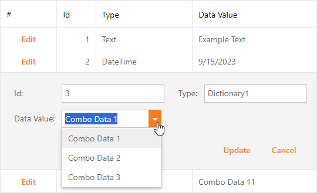

<!-- default badges list -->

<!-- default badges end -->

# Grid for ASP.NET Web Forms - How to initialize an Edit Form editor based on a value of another column
<!-- run online -->
**[[Run Online]](https://codecentral.devexpress.com/128534940/)**
<!-- run online end -->

This example demonstrates how to initialize an editor in grid edit form conditionally based on a value of another column.

## Implementation Details

Follow the steps below to implement this functionality:

1. Create a custom class that implements the `ITemplate` interface.
2. Call the [ASPxGridView.GetRowValues](https://docs.devexpress.com/AspNet/DevExpress.Web.ASPxGridView.GetRowValues(System.Int32-System.String--)) method to get current row values.
3. Create an editor conditionally based on the obtained row values.
4. Assign the custom template class to the [GridViewDataColumn.EditItemTemplate](https://docs.devexpress.com/AspNet/DevExpress.Web.GridViewDataColumn.EditItemTemplate) or [GridViewTemplates.EditForm](https://docs.devexpress.com/AspNet/DevExpress.Web.GridViewTemplates.EditForm) property.
5. To save modified data, handle the [RowUpdating](https://docs.devexpress.com/AspNet/DevExpress.Web.ASPxGridView.RowUpdating) event. In the event handler, call the [FindEditFormTemplateControl](https://docs.devexpress.com/AspNet/DevExpress.Web.ASPxGridView.FindEditFormTemplateControl(System.String)) or [FindEditRowCellTemplateControl](https://docs.devexpress.com/AspNet/DevExpress.Web.ASPxGridView.FindEditRowCellTemplateControl(DevExpress.Web.GridViewDataColumn-System.String)) method to obtain a custom editor. Assign editor's value to the corresponding item in the [NewValues](https://docs.devexpress.com/AspNet/DevExpress.Web.Data.ASPxDataUpdatingEventArgs.NewValues) dictionary.
6. Handle the [CustomColumnDisplayText](https://docs.devexpress.com/AspNet/DevExpress.Web.ASPxGridView.CustomColumnDisplayText) event to specify text that is displayed in the grid.

## Files to Review

* [CustomEditForm.aspx](./CS/WebApplication_Grid/CustomEditForm.aspx)
* [CustomEditForm.aspx.cs](./CS/WebApplication_Grid/CustomEditForm.aspx.cs)
* [CustomEditItem.aspx](./CS/WebApplication_Grid/CustomEditItem.aspx)
* [CustomEditItem.aspx.cs](./CS/WebApplication_Grid/CustomEditItem.aspx.cs)
* [CustomEditFormTemplate.cs](./CS/WebApplication_Grid/Templates/CustomEditFormTemplate.cs)
* [CustomEditItemTemplate.cs](./CS/WebApplication_Grid/Templates/CustomEditItemTemplate.cs)
